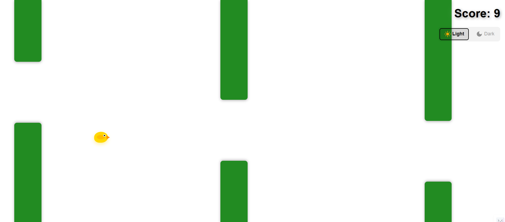

# Flappy Bird Game

A modern implementation of the classic Flappy Bird game built with React, TypeScript, and Material-UI.

## Screenshots

### Light Mode


### Dark Mode


## Features

- Classic Flappy Bird gameplay mechanics
- Smooth physics and collision detection
- Score tracking
- Game over screen with restart functionality
- Responsive design
- Built with modern React hooks and TypeScript

## Tech Stack

- **React 19** - UI framework
- **TypeScript** - Type safety
- **Vite** - Build tool and dev server
- **Material-UI** - Component library
- **Vitest** - Testing framework
- **ESLint** - Code linting

## Getting Started

### Prerequisites

- [Node.js](https://nodejs.org/en) (v18 or higher)
- [npm](https://docs.npmjs.com/)

### Installation

```bash
npm install
```

### Development

Run the development server:

```bash
npm run dev
```

Open your browser and navigate to the local URL shown in the terminal (typically `http://localhost:5173`).

### Building for Production

```bash
npm run build
```

The built files will be in the `dist` directory.

### Preview Production Build

```bash
npm run preview
```

## Testing

Run tests once:

```bash
npm test
```

Run tests in watch mode:

```bash
npm run test:watch
```

Run tests with UI:

```bash
npm run test:ui
```

## How to Play

- Click or press any key to make the bird jump
- Avoid the obstacles
- Try to get the highest score possible!

## Project Structure

```
src/
├── components/       # React components
│   ├── Bird.tsx
│   ├── GameContainer.tsx
│   ├── GameOverScreen.tsx
│   ├── Obstacle.tsx
│   └── ScoreDisplay.tsx
├── utils/           # Game logic and utilities
│   ├── collision.ts
│   ├── gameState.ts
│   ├── obstacles.ts
│   ├── physics.ts
│   ├── score.ts
│   └── constants.ts
├── types/           # TypeScript type definitions
└── hooks/           # Custom React hooks
```
